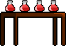
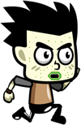
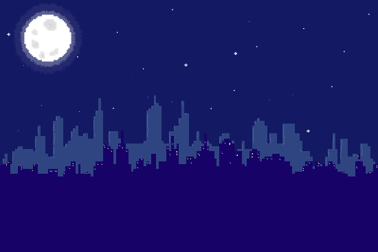

# Wrecking Pandemic
> Game Design Document

# Table of Content

- [Game Design](#game-design)
    - [Summary](#summary)
    - [Gameplay](#gameplay)
    - [Mindset](#mindset)
- [Technical](#technical)
    - [Screens](#screens)
    - [Controls](#controls)
    - [Mechanics](#mechanics)
- [Level Design](#level-design)
    - [Themes](#themes)
    - [Game Flow](#game-flow)
- [Development](#development)
    - [Abstract Classes / Components](#abstract-classes--components)
    - [Derived Classes / Component Compositions](#derived-classes--component-compositions)
- [Graphics](#graphics)
    - [Style Attributes](#style-attributes)
    - [Graphics Needed](#graphics-needed)
- [Sounds/Music](#soundsmusic)
    - [Style Attributes](#style-attributes-1)
    - [Sounds Needed](#sounds-needed)
    - [Music Needed](#music-needed)
- [Schedule](#schedule)


# Game Design

## Summary
Wrecking Pandemic es un platformer 2D sobre una ingeniera biomédica que debe salvar al mundo de una pandemia y de aquellos que no siguen las regulaciones. Ella diseña y construye las herramientas perfectas para cada nivel; incluyendo un spray curativo, pócima de doble salto y armadura protectiva.


## Gameplay
Al ser un platformer 2D, Wrecking Pandemic incluye principalmente movimiento de izquierda a derecha con saltos para evitar enemigos y llegar a plataformas. El objetivo del juego es llegar al final, derrotar el mini-boss y conseguir el componente de la cura del nivel correspondiente. Al principio de cada nivel Emily diseña una herramienta que le otorga una habilidad perfecta para el nivel, y debe de usar esta para sobrepasar los objetivos particulares del nivel. El jugador debe adaptarse para estas situaciones únicas, pero siempre manteniendo la esencia de moverse de izquierda a derecha y saltar. 

## Mindset
Es deseado que el jugador tenga la mentalidad de empoderamiento y aventura, para motivarlo hacia la toma de decisión de una carrera relacionada a STEM. Esto se hará a través de las grandes habilidades del personaje principal Emily, y los grandes obstáculos que logra sobrepasar por el bien del mundo. Al ver la capacidad y el resultado del esfuerzo de Emily, el jugador sentirá todo esto y más.

# Technical
 
## Screens

```
1. Title Screen
2. Between Levels Screen
3. Game
    a. Power-ups Obtained
4. End Credits
```

## Controls
El jugador no puede modificar los controles, pero se les dirá cuales son al comenzar el juego. El jugador podrá interactuar con ciertos objetos en su alrededor, incluyendo las mesas de construcción, checkpoints, y enemigos. Esto principalmente se hace simplemente caminando por el objeto, aunque el jugador podrá derrotar a los enemigos presionando la tecla "P" para disparar el proyectil.

## Mechanics
Al comenzar el juego el avatar solo puede moverse hacia los lados y saltar una sola vez. Durante el transcurso del juego obtienes nuevas habilidades, en el siguiente orden:


- Principio del nivel 1 - Obtienes la habilidad de disparar el proyectil de spray al presionar la tecla "P". Este proyectil destruye a los enemigos comunes con un solo golpe, pero a los bosses se les debe disparar varias veces.
- Principio del nivel 2 - Obtienes la habilidad de saltar una vez adicional después de tu primer salto. Esto se hace a través de un int que mide cuantos saltos te quedan, comenzando con 1 pero volviendose 2 al conseguir esta habilidad. Este int se resettea al tocar el suelo después de saltar.
- Principio del nivel 3 - Obtienes la habilidad de protección con el escudo, bloqueando proyectiles con la tecla "O". Esos proyectiles solo se pueden bloquear frente a Emily, proyectiles detrás aún causarán daño.



Cada boss tiene sus propias mecánicas:


- El Anti-masker tiene la habilidad de llamar a mini anti-maskers para correr hacia el jugador, aunque no sean atacados, estos siempre se moveran a la derecha sin regresar. Si son atacados, son derrotados en un solo golpe como el resto de los enemigos comunes. El anti-masker también tiene la habilidad de gritar tan fuerte que lanza un proyectil que se debe evitar saltando por encima o caminando por debajo. El anti-masker debe recibir 5 ataques antes de ser derrotado y tiene unos segundos de invulnerabilidad al ser atacado.
- El Sick-farmer tiene la habilidad de saltar y lanzar maíz contaminado en tres posibles alturas y direcciones. El granjero debe recibir 5 ataques antes de ser derrotado, habra plataformas para que el ususario pueda esquivar los maices no importa cual dirección tome siempre habra manera de evitarlos.
- El Evil-bat es un murcielago mutante que tiene la capacidad lanzar un virus, habra tres diferentes mutaciones del virus: la verde que es un lanzamiento recto a media altura, la amarilla que rueda por el piso y la roja que ira botando, el Evil-bat debe de recibir 7 atques antes de ser derrotado, y tendra momento de invulnerabilidad 


Sick-guy: se mueve de derecha a izquierda y al contacto con el el usuario recibe daño, con un solo ataque es derrotado.



Mini-bat: vuela a media altura de dercha a izquierda en la escena, al contacto con el el usuario recibe daño, con un solo ataque es derrotado.

Las mecánicas principales son el doble salto y el proyectil. Esto se cumplirá a través de checks de estado para ver si puedes saltar, al igual que mecánicas dentro del sistema para diseñar proyectiles que se originan del personaje y se hacen más grandes al alejarse de este.

# Level Design


## Themes
```
1.	City at Night
    a.	Mood
        i.	Suspenseful, dark, dangerous
    b.	Objects
        i.	Ambient
            1.	Trash
            2.	Moonlight
            3.	Cars
            4.	Advertising Billboards
        ii.	Interactive
            1.	Wooden Platforms
            2.	Sick Citizens (Enemy)
            3.	Chasms
            4.	Anti-masker (Karen) boss 
```

```
2.	Plains
    a.	Mood
        i.	Peaceful, calm, active
    b.	Objects
        i.	Ambient
            1.	Trees
            2.	Grass
            3.	Critters
            4.	Fences
        ii.	Interactive
            1.	Sick Countrymen (Enemy)
            2.	Platforms
            3.	Workbench
            4.	Sick Farmer boss
```

```
3.	Cavern
    a.	Mood
        i.	Spooky, threatening, silent
    b.	Objects
        i.	Ambient
            1.	Stalagmite
            2.	Dew drops
            3.	Critters
            4.	Danger signs
        ii.	Interactive
            1.	Mini-Bats (Enemy)
            2.	Stalagmites/Stalactites
            3.	Workbench
            4.	Evil-bat Boss
```


## Game Flow
```
1.	Player starts in city, leftmost part of screen
2.	Wall to the left, player must move right
3.	To the right is a wall with a platform nearby, player must jump on platform to traverse wall (“jump” taught)
4.	Player encounters sick guy - must avoid him to reach workbench
5.	Player reaches workbench and message of new skill learned appears
6.	Player utilizes spray skill to eliminate enemy (“spray” taught)
7.	If player is hit, character yelps in pain and interface shows one less heart ("health" taught)
8.	To the right is a checkpoint, player must walk through it to progress ("checkpoints" taught)
9.	If all hitpoints are lost, character appears in last checkpoint ("continnue" taught)
10.	Player encounters anti-masker, requires multiple hits to be defeated ("bosses" taught)
11.	Player encounters end goal, must walk through it to continue right ("level end" taught)
```


# Development
 
## Abstract Classes / Components
```
1.	BasePhysics
    a.	BasePlayer
    b.	BaseEnemy
    c.	BaseObject
2.	BaseObstacle
```


## Derived Classes / Component Compositions
```
1.	BasePlayer
    a.	PlayerMain
2.	BaseEnemy
    a.	Sick-guy
    b.	mini-bat
    	Bosses
    c.	Anti-masker
    d.	Sick-farmer
    e.	Evil-bat
3.	BaseObject
    a.	Workshop Table (interactable, obtain power-up)
    b.	Checkpoint (interactable, saves spot for future defeat)
    c.	End-goal ingredients (interactable, finishes the level)
3.	BaseObstacle
    a.	PlatformMain
    b.	BaseChasm
    
```

# Graphics

## Style Attributes
No se planea limitaciones de paleta, pero por lo general se utilizarán los mismos tipos de colores de cierto nivel. (Colores negros y grices para la ciudad, verdes y azules para el bosque, morados y negro para la cueva)

El estilo gráficos es pixeleado, con escenarios con semejanza a la realidad en situaciones extremas y peculiares. Los personajes del juego tienen un contorno ligero negro, y los escenarios al igual mantienen el mismo estilo. Por lo general los sprites no tienen mucha curvatura y son pequeños.

La mesa de power-ups tendrá un contorno brillante blanco (al igual que los checkpoints) para que el usuario sepa que es algo que debe de tocar, al pararse frente a estos, el contorno cambiará de color para mostrar que esto fue coleccionado.

Si el jugador es golpeado por un enemigo, brillará temporalmente y se escuchará un sonido de dolor correspondiente. Los enemigos tendrán el mismo efecto pero desaparecerán poco tiempo después.


## Graphics Needed
```
1.	Characters
    a.	Human-like
        i.	Emily (idle, walking, holding)
        ii.	Sick-guy (walking)
        iii.	Anti-masker (walking, screaming, damaged)
	iv.	Sick-farmer (walking, throwing, contaminating, damaged)
    b.	Other
        i.	Mini-bat (flying)
        ii.	Evil-bat (flying, throwing, damaged)
2.	Blocks
    a.	Cement
    b.	Dirt/Grass
    c.	Metal
    d.	Wood
    e.	Stone
    f.	Water
3.	Ambient
    a.	Tall Grass
    b.	Critter (scurrying)
    c.	Trash
    d.	Stalagmite
    e.	Bones
4.	Other
    a.	Table
    b.	Gel Station
    c.	Crafting Tools
    d.	Ingredients
    e. Books
```

# Sounds/Music
 
## Style Attributes
Música electrónica con tempos rápidos de suspenso.

Los efectos de sonido son algo sutiles pero no tanto para ser realista.

## Sounds Needed
```
1.	Effects
    a.	Soft Footsteps (grassy terrain)
    b.	Sharper Footsteps (stone/metal floor)
    c.	Soft Landing (low vertical velocity)
    d.	Hard Landing (high vertical velocity)
    e.	Spray sound
    f.	Whooshing sound
2.	Feedback
    a.	Relieved “Ahhhh!” (health)
    b.	Shocked “Ouch!” (attacked)
    d.	Sad chime (infected)
```

## Music Needed
```
1.	Energetic “forest” track
2.	High-octane “city” track
3.	Creepy, slow “cavern” track
4.	Happy menu track
``` 

# Schedule

```
1.	develop base classes
    a.	base entity
        i.	Emily
        ii.	Enemy
        iii.	Platform
    b.	base app state
        i.	game world
        ii.	menu world
2.	develop player and basic block classes
    a.	physics / collisions
3.	find some smooth controls/physics
4.	develop other derived classes
    a.	blocks
        i.	moving
        ii. 	dropping
    b.	enemies
        i. Sick-guy
        ii.	Mini-bat
        iii. Anti-masker
	iv. Sick farmer
	v. Evil-bat
5.	design levels
	i. Forest Level and Boss
	ii. City Level and Boss
	iii. Cavern Level and Boss
a.	introduce motion/jumping
6.	design sounds
7.	design music
```

