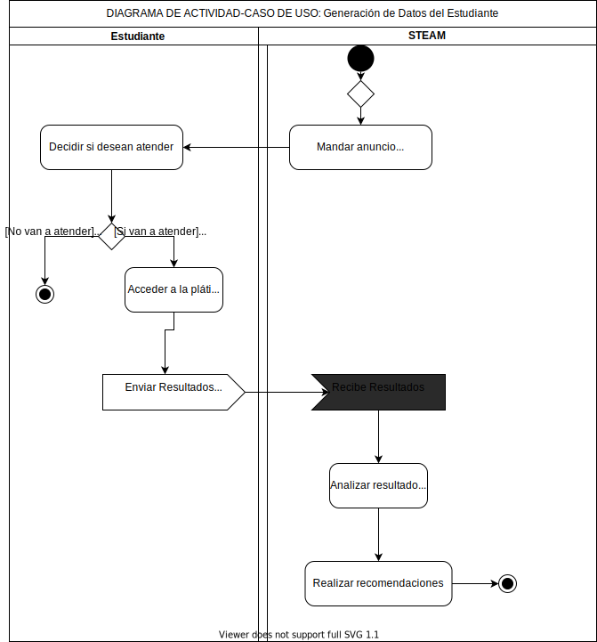
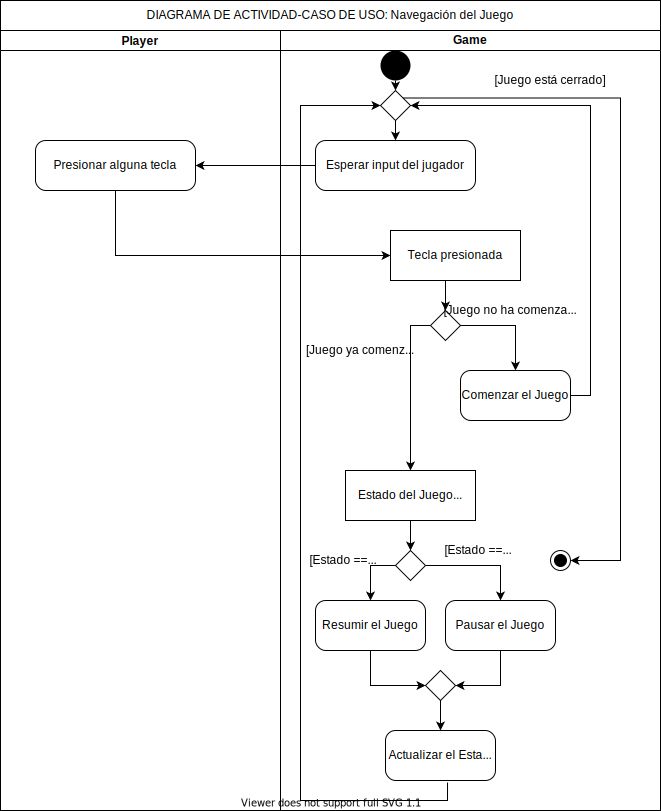
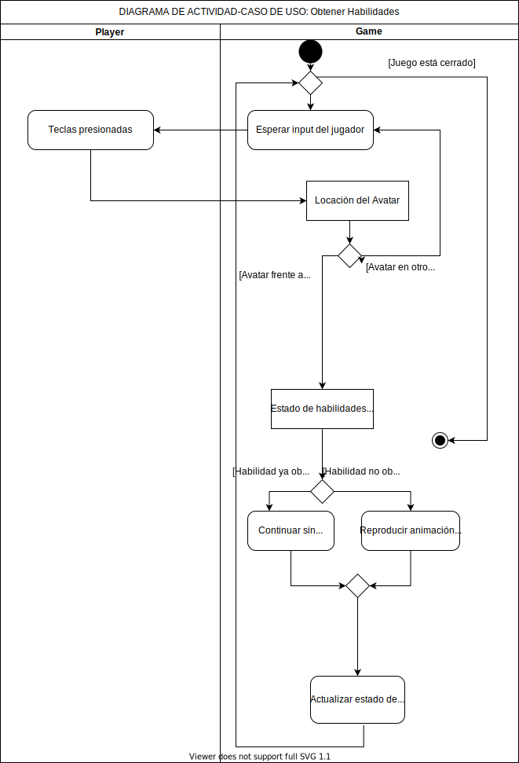
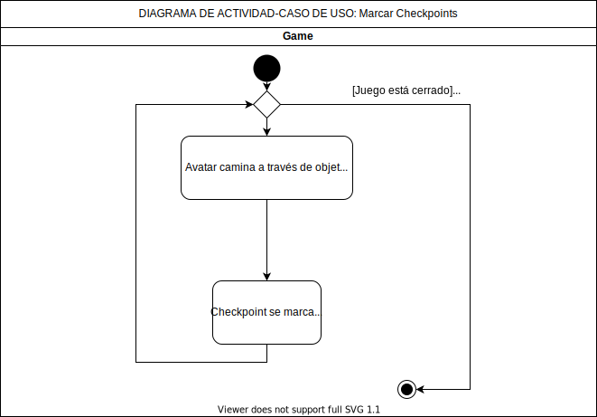

# UML Modeling

## Table of content

- [Business Use Case Model](#business-use-case-model)
- [Subsystem Use Case Model -> Game](#subsystem-use-case-model---Game)
- [Activity Diagram -> Generación de Datos Business Use Case](#activity-diagram---generación-de-datos-business-use-case)
- [Activity Diagram -> Control de Personaje Use Case](#activity-diagram---control-de-personaje-system-use-case)
- [Activity Diagram -> Continuar Juego System Use Case](#activity-diagram---continuar-juego-system-use-case)
- [Activity Diagram -> Navegación del Juego System Use Case](#activity-diagram---navegación-del-juego-system-use-case)
- [Activity Diagram -> Obtener Habilidades System Use Case](#activity-diagram---obtener-habilidades-system-use-case)
- [Activity Diagram -> Marcar Checkpoints System Use Case](#activity-diagram---marcar-checkpoints-system-use-case)

## Business Use Case Model

## Subsystem Use Case Model -> Game

## Activity Diagram -> Generación de Datos Business Use Case

## Activity Diagram -> Control de Personaje System Use Case

## Activity Diagram -> Continuar Juego System Use Case

## Activity Diagram -> Navegación del Juego System Use Case

## Activity Diagram -> Obtener Habilidades System Use Case

## Activity Diagram -> Marcar Checkpoints System Use Case

